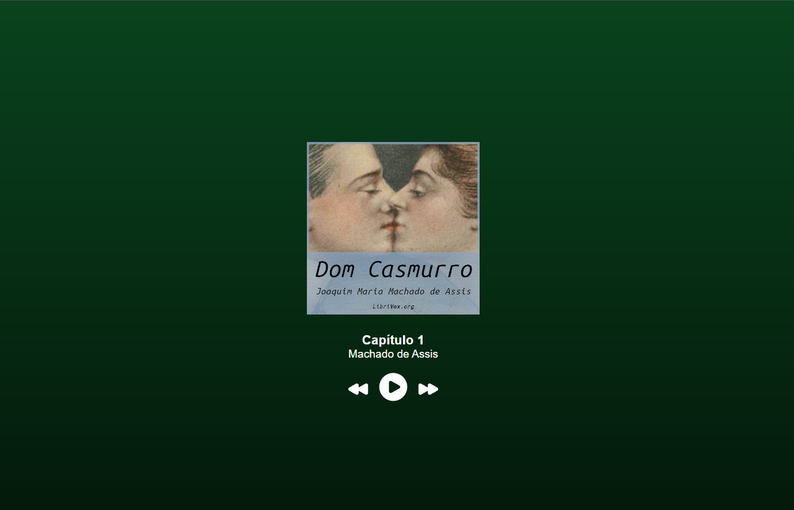
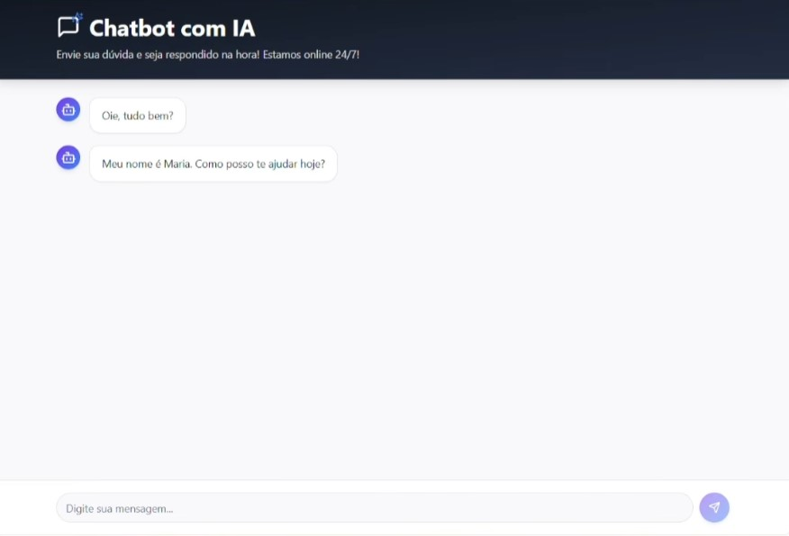

# 🚀 Intensivão JavaScript: 4 Projetos em 5 Dias

---

## 🇧🇷 Português

### 💡 Sobre o Desafio

Este repositório documenta minha jornada de 5 dias em um intensivão de JavaScript, onde desenvolvi quatro projetos práticos que cobrem desde o front-end puro com HTML/CSS até aplicações modernas com React e integração com Inteligência Artificial.

### 🛠️ Tecnologias Principais


---

### 📂 Projetos Desenvolvidos

Aqui está uma visão geral dos 4 projetos concluídos durante o intensivão.

| Projeto | Descrição | Tecnologias | Prévia |
| :--- | :--- | :--- | :--- |
| **1. Audiobook Dom Casmurro** | Um player de audiobook interativo para a obra clássica de Machado de Assis. | `HTML` `CSS` `JS` |  |
| **2. Landing Page Apple Watch** | Clone visual da página de produto do Apple Watch, focando em design responsivo e moderno. | `HTML` `CSS` |  |
| **3. Cardápio Digital** | Aplicação em React para um cardápio digital de restaurante, permitindo navegação e seleção de itens. | `React` `JS` `CSS` |  |
| **4. Chatbot com IA** | Um chatbot funcional integrado a uma API de IA (Lovable AI) para interação em tempo real. | `JS` `HTML` `Lovable AI` |  |

*(**Nota:** Os links das imagens acima são placeholders. Veja abaixo como adicionar suas imagens locais.)*

### 🏃 Como Executar

Cada projeto está em sua própria pasta.

1.  Clone este repositório:
    ```bash
    git clone (https://github.com/VitorTakiuti/5DaysOfJavaScript.git)
    ```
2.  **Para os projetos 1, 2 e 4 (HTML/CSS/JS):**
    * Navegue até a pasta do projeto (ex: `cd projeto-audiobook`).
    * Abra o arquivo `index.html` no seu navegador.
3.  **Para o projeto 3 (Cardápio React):**
    * Navegue até a pasta do projeto (`cd projeto-cardapio`).
    * Instale as dependências: `npm install`
    * Execute o projeto: `npm start`

---
---

## 🇺🇸 English

### 💡 About The Challenge

This repository documents my 5-day journey through a JavaScript intensive, where I developed four practical projects covering pure front-end with HTML/CSS, modern applications with React, and integration with Artificial Intelligence.

### 🛠️ Core Technologies


---

### 📂 Projects Overview

Here is an overview of the 4 projects completed during the bootcamp.

| Project | Description | Technologies | Preview |
| :--- | :--- | :--- | :--- |
| **1. Dom Casmurro Audiobook** | An interactive audiobook player for the classic Brazilian novel by Machado de Assis. | `HTML` `CSS` `JS` | |
| **2. Apple Watch Landing Page** | A visual clone of the Apple Watch product page, focusing on modern, responsive design. | `HTML` `CSS` |  |
| **3. Digital Menu** | A React application for a digital restaurant menu, allowing users to browse and select items. | `React` `JS` `CSS` |  |
| **4. AI Chatbot** | A functional chatbot integrated with an AI API (Lovable AI) for real-time interaction. | `JS` `HTML` `Lovable AI` |  |

*(**Note:** The image links above are placeholders. See below for instructions on adding your local images.)*

### 🏃 How to Run

Each project is in its own folder.

1.  Clone this repository:
    ```bash
    git clone (https://github.com/VitorTakiuti/5DaysOfJavaScript.git)
    ```
2.  **For projects 1, 2, and 4 (HTML/CSS/JS):**
    * Navigate to the project folder (e.g., `cd project-audiobook`).
    * Open the `index.html` file in your browser.
3.  **For project 3 (React Menu):**
    * Navigate to the project folder (`cd project-menu`).
    * Install dependencies: `npm install`
    * Run the project: `npm start`
